# Jmeter Prometheus Remote Write tests

Here I have tested one of open source jmeter plugins which supports prometheus remote write, here is the github repo [link](https://github.com/kolesnikovm/jmeter-prometheus-listener)

# Test setup

Tests are done with the help of a custom jmeter docker image with the jmeter plugin in k8s environment (Landscape - canary, namespace - playground)

# All Jmeter Metrics

This plugin provides the following metrics -

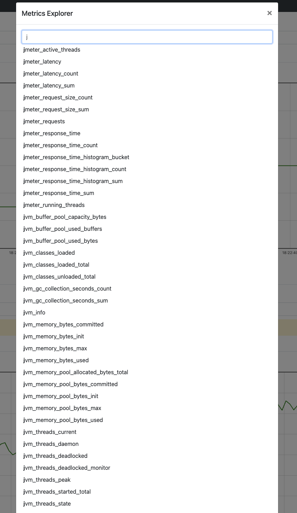

## Test with httpbin get request (link to [script](jmeterscripts/httpbin-get.jmx))

Test results -

| MAX TPS(req/s)  | JMeter Resource Usage                    | Httpbin Resource Usage                    | Prometheus Resource Usage                  | 
|     :----:      |       :----:                             |      :----:                               |          :--------:                        |
|     12.8K       | Max. CPU = 1.42 C, Max. Memory = 829 MiB | Max. CPU = 1.72 C, Max. Memory = 17.2 MiB | Max. CPU = 0.0154 C, Max. Memory = 276 MiB |

Resource consumption graphs =>

- jmeter

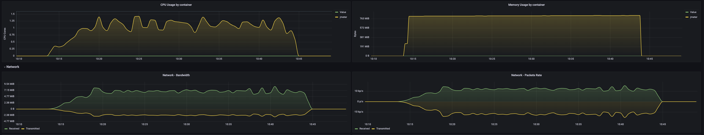

- httpbin

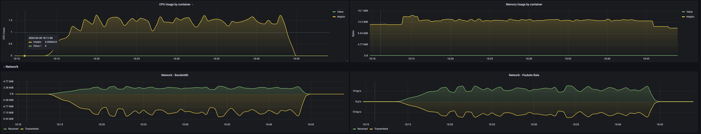

- prometheus

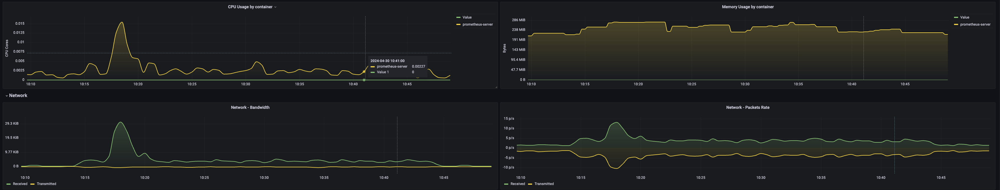

Grafana results,

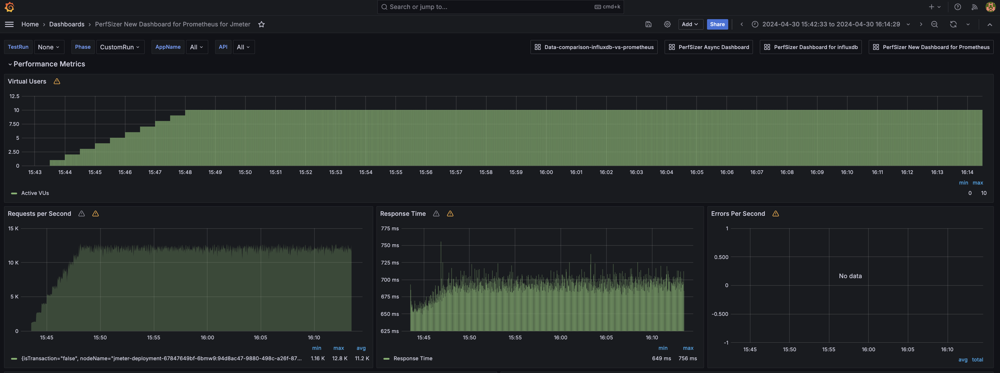

## Test with httpbin post request with 1kb payload (link to [script](jmeterscripts/httpbin-post-1kbpayload.jmx))

Test results -

| MAX TPS(req/s)  | JMeter Resource Usage                    | Httpbin Resource Usage                    | Prometheus Resource Usage                  | 
|     :----:      |       :----:                             |      :----:                               |          :--------:                        |
|     11K         | Max. CPU = 1.58 C, Max. Memory = 829 MiB | Max. CPU = 2.17 C, Max. Memory = 15.0 MiB | Max. CPU = 0.0151 C, Max. Memory = 282 MiB |

Resource consumption graphs =>

- jmeter

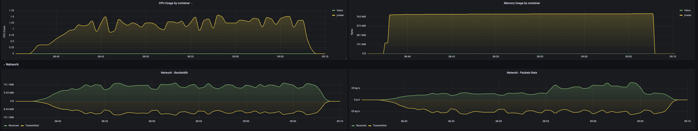

- httpbin

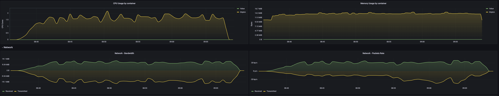

- prometheus

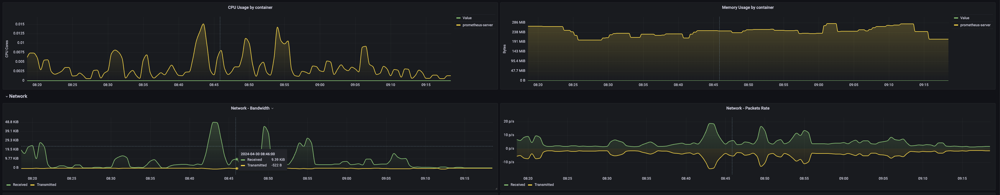

Grafana results,

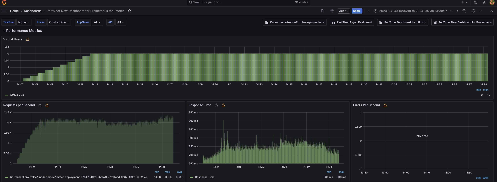

## Test with httpbin post request with 11kb payload  (link to [script](jmeterscripts/httpbin-post-11kbpayload.jmx))

Test results -

| MAX TPS(req/s)  | JMeter Resource Usage                    | Httpbin Resource Usage                    | Prometheus Resource Usage                  | 
|     :----:      |       :----:                             |      :----:                               |          :--------:                        |
|     5.3K        | Max. CPU = 1.31 C, Max. Memory = 834 MiB | Max. CPU = 2.85 C, Max. Memory = 18.0 MiB | Max. CPU = 0.0143 C, Max. Memory = 282 MiB |

Resource consumption graphs =>

- jmeter

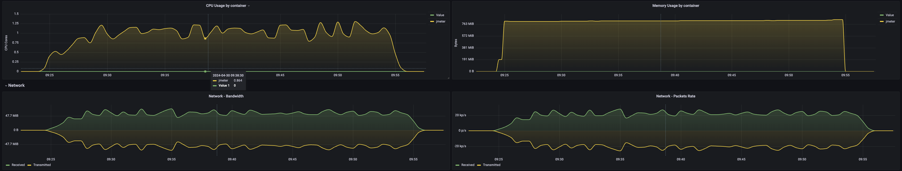

- httpbin

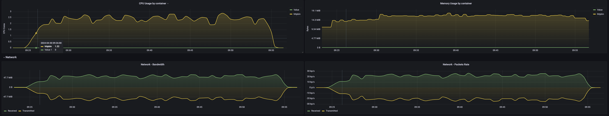

- prometheus

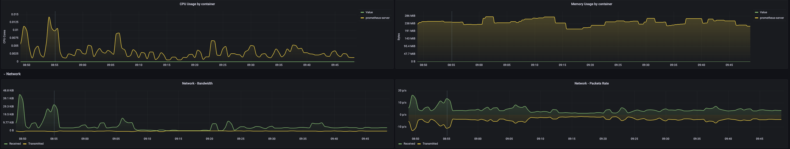

Grafana results,

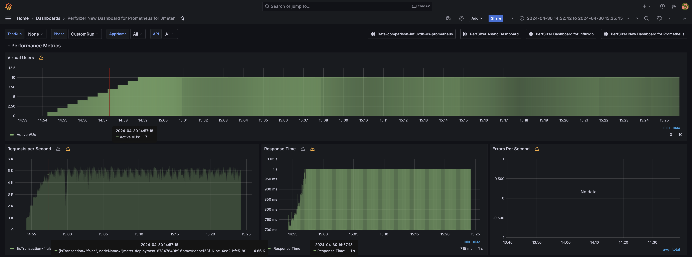

# Inferences and Next steps

- This jmeter plugin works well for smaller tps tests as of now, even assertion results and jvm metrics can be obtainable via enabling parameters. 
- Currently tests are conducted targetting @10K tps and may be extensively tested in future for recording resource comsumptions of jmeter and prometheus for high tps like 30K and upto 100K if required.

