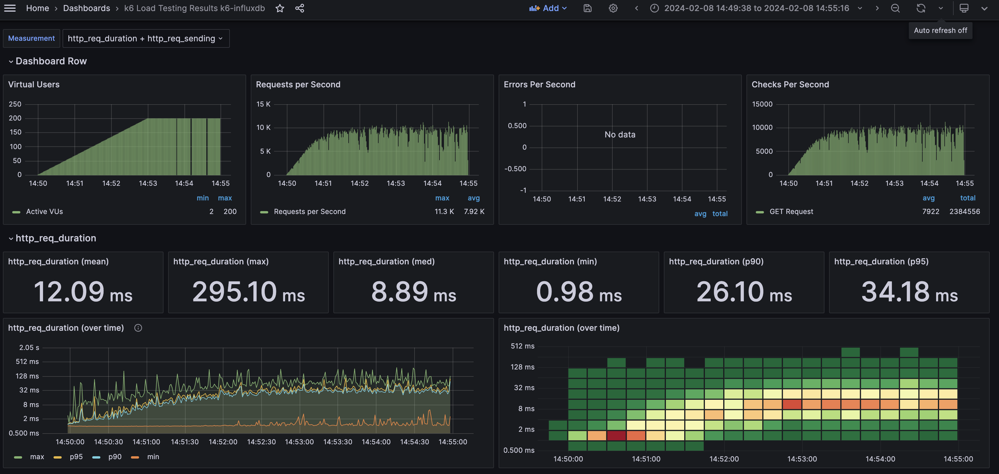
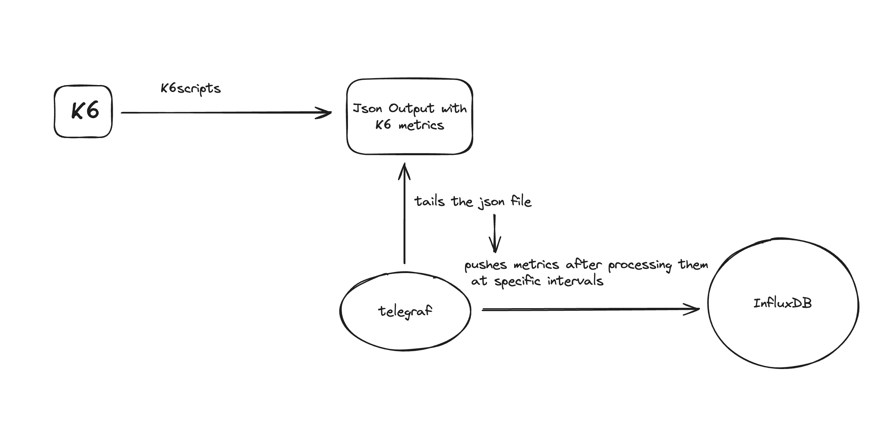

# High TPS TESTS WITH TELEGRAF

This repo intends to find optimised approaches to for High TPS support(>15K/s) for K6 metrics.
Here we have discussed for first approach for as discussed in the issue.

## Goal

Initially We were pushing K6 metrics directly to InfluxDB via [K6 InfluxDB output option](https://k6.io/docs/results-output/real-time/influxdb/)
But the problem we faced is when K6 produces more than 10-11K requests per second for high load applications the load on InfluxDB, the difference in the time taken for metrics flush operation and the push interval at which K6 metrics are pushed to influxdb becomes larger and larger and eventually resulting in loss of metrics.

For example see the below image for one of the measurements(active vus) where some vus entries are missing,



So to mitigate this problem and according to our main usecase which is to fetch any measurement after every 1s/2s (configurable), we have introduced telegraf as an agent to collect K6 metrics from a output file and send the metrics after a specific time interval

## Approach

So basically the flow of the process is described below,



For this purpose in K8S environment, a K8s-telegraf deployment is created with K6 scripts and telegraf configs and secrets. When K6script is executed, telegraf simultaneously tails the output file and the new datapoints are sent to the Influxdb after specific interval, this way the main advantage is telegraf sends fixed number of metrics every second to the influxdb and we can avoid loss of metrics in influxdb. 

## Test SetUp

First, all the telegraf secrets, configs and k6scripts config and influxdb secrects should be deployed. All the yamls, configs for example purpose is also given here

CLI commands for this purpose,

Create Telegraf ConfigMap for telegraf.conf

```sh
kubectl create configmap telegraf-config --from-file=/path_to_telegraf_config/telegraf.conf
```

Create Telegraf Configuration Secrets

```sh
kubectl create secret generic telegraf-secrets --from-literal=POLL_INTERVAL=VALUE_1 --from-literal=INFLUX_HOST=VALUE_2 --from-literal=INFLUX_DATABASE=VALUE_3 --from-literal=INFLUX_USERNAME=VALUE_4 --from-literal=INFLUX_PASSWORD=VALUE_5
```

> NOTE: Here VALUE_1, VALUE_2, .. are placeholders

Create Influxdb secrets

```sh
kubectl create secret generic influxdb-secrets --from-literal=INFLUXDB_DATABASE=VALUE_1 --from-literal=INFLUXDB_USERNAME=VALUE_2 --from-literal=INFLUXDB_PASSWORD=VALUE_3 --from-literal=INFLUXDB_HOST=VALUE_4
```

Create K6scripts configmap

```sh
kubectl create configmap k6scripts-config --from-file=/path_to_scripts_folder/k6scripts
```

Now apply the k6-telegraf deployment and influxdb yamls in the namespace desired namespace, a sample nginx deployment is also there to test with

```sh
kubectl apply -f YAML_FILE
```

For commands regarding running the k6scripts and telegraf config refer the [Telegraf Github](https://github.com/influxdata/telegraf) and [K6 docs](https://k6.io/docs/)

## Results

### JSON Output

For Writing Output option as [JSON](https://k6.io/docs/results-output/real-time/json/), here are all the results with nginx deployment with 1 replica (testurl is service-dns which shows simple html page)

> NOTE: k6-tel-inf => Case for pushing k6 metrics to influxdb via telegraf, k6-inf => case for pushing k6 metrics directly to influxdb

| Test Scenario Stages     | k6-tel-inf avg RT(ms) | k6-inf avg RT(ms) | k6-inf Max TPS    | k6-tel-inf max CPU Usage(cores)                   | k6-inf max CPU Usage(cores) | k6-tel-inf max Mem Usage                        | k6-inf max Mem Usage              |
| :----------------:       |          :----:       |       :----:      |      :----:       |           :----:                                  |        :----:               |         :----:                                  |        :----:                     |
| 3m0s:20, 2m0s:20         |          1.49         |      1.5          |      2.94K        | K6=1.0558,telegraf=3.4467,influxdb=0.0088         | K6=1.0950,influxdb=0.5224   |K6=2.1GiB,telegraf=225.09MiB,influxdb=           | K6=184.76 MiB,influxdb=67.88 MiB  |
| 3m0s:30, 2m0s:30         |          1.46         |      1.67         |      4.39K        | K6=1.5217,telegraf=3.5083,influxdb=0.0117         | K6=1.5922,influxdb=1.0697   |K6=3.15GiB,telegraf=275.63MiB,influxdb=          | K6=256.75 MiB,influxdb=177.32 MiB |
| 3m0s:50, 2m0s:50         |          2.37         |       2           |      7.33K        | K6=2.3040,telegraf=3.5330,influxdb=0.0159	       | K6=2.5132,influxdb=0.8410   |K6=5.09GiB,telegraf=276.37MiB,influxdb=          | K6=431.70 MiB,influxdb=302.22 MiB |
| 3m0s:80, 2m0s:80         |          3.75         |      3.29         |      9.75K        | K6=2.6927,telegraf=5.1936,influxdb=0.0103         | K6=3.2775,influxdb=1.2520   |K6=6.74GiB,telegraf=327.97MiB,influxdb=          | K6=575.81 MiB,influxdb=7.54 GiB   |
| 3m0s:100, 2m0s:100       |          4.99         |      4.7          |      10.7K        | K6=2.8280,telegraf=5.2033,influxdb=0.0122         | K6=3.4945,influxdb=1.0860   |K6=7.3GiB,telegraf=386.21MiB,influxdb=           | K6=,influxdb=                     |
| 3m0s:150, 2m0s:150       |          9.85         |      8.21         |      11.2K        | K6=3.1252,telegraf=5.2043,influxdb=0.0113         | K6=3.6702,influxdb=1.8898   |K6=7.97GiB,telegraf=392.63MiB,influxdb=          | K6=,influxdb=                     |
| 3m0s:300, 2m0s:300       |          20.62        |      19.39        |      11.4K        | K6=3.0383,telegraf=5.2018,influxdb=0.0121         | K6=3.9701,influxdb=4.8547   |K6=8.25GiB,telegraf=792.24MiB,influxdb=          | K6=,influxdb=                     |

> NOTE: Tests are done continuously with no renewal of k6 telegraf containers results may differ for individual tests

### CSV Output

For CSV output options here are the results shown below,

| Test Scenario Stages     | k6-tel-inf avg RT(ms) | k6-inf avg RT(ms) | k6-inf Max TPS    | k6-tel-inf max CPU Usage(cores)                   | k6-inf max CPU Usage(cores) | k6-tel-inf max Mem Usage                            | k6-inf max Mem Usage              |
| :----------------:       |          :----:       |       :----:      |      :----:       |           :----:                                  |        :----:               |         :----:                                      |        :----:                     |
| 3m0s:20, 2m0s:20         |          0.68         |      1.5          |      3.32K        | K6=1.3581,telegraf=2.0643,influxdb=1.5028         | K6=1.0950,influxdb=0.5224   |K6=213.64 MiB,telegraf=548.16 MiB,influxdb=173.44 MiB    | K6=184.76 MiB,influxdb=67.88 MiB  |
| 3m0s:30, 2m0s:30         |          0.74         |      1.67         |      4.86K        | K6=1.9461,telegraf=2.2360,influxdb=0.9774	       | K6=1.5922,influxdb=1.0697   |K6=313.89 MiB,telegraf=566.70 MiB,influxdb=220.68 MiB    | K6=256.75 MiB,influxdb=177.32 MiB |
| 3m0s:50, 2m0s:50         |          0.80         |       2           |      8.09K        | K6=3.1007,telegraf=2.2678,influxdb=4.6989	       | K6=2.5132,influxdb=0.8410   |K6=546.86 MiB,telegraf=693.00 MiB,influxdb=222.55 MiB	   | K6=431.70 MiB,influxdb=302.22 MiB |
| 3m0s:80, 2m0s:80         |          3.02         |      3.29         |      11.2K        | K6=3.9858,telegraf=3.9775,influxdb=2.8646         | K6=3.2775,influxdb=1.2520   |K6=766.86 MiB,telegraf=133.39 MiB,influxdb=238.41 MiB         | K6=575.81 MiB,influxdb=7.54 GiB   |
| 3m0s:100, 2m0s:100       |          4.74         |      4.7          |      10.7K        | K6=4.1290,telegraf=1.2756,influxdb=2.8972         | K6=3.4945,influxdb=1.0860   |K6=4.10 GiB,telegraf=208.94 MiB,influxdb=304.17 MiB         | K6=,influxdb=                     |
| 3m0s:150, 2m0s:150       |          8.21         |      8.21         |      11.2K        | K6=,telegraf=,influxdb=         | K6=3.6702,influxdb=1.8898   |K6=,telegraf=,influxdb=      | K6=,influxdb=                     |
| 3m0s:300, 2m0s:300       |          16.00        |      19.39        |      11.6K        | K6=3.9591,telegraf=1.8364,influxdb=1.8390	       | K6=3.9701,influxdb=4.8547   |K6=1003.58 MiB,telegraf=715.26 MiB,influxdb=218.65 MiB      | K6=,influxdb=                     |

> NOTE: Tests are done continuously with no renewal of k6 telegraf containers results may differ for individual tests

## Inferences

* Since the number of metrics to be written on InfluxDB per second is around constant the CPU usage of InfluxDB has drastically come down but on the other side CPU usage of telegraf can go upto 5.2 cores, difference in cpu usage of K6 is slightly low and the memory usage by K6 container is also high.

* For CSV output for every testrun(new k6-telegraf pod), telegraf consumes around 1.7-1.8 cores whereas for json, telegraf consumes around 3.5 cores and memory usage for k6 is also halved

* For small 5min tests, csv file size reaches upto 3.7 Gi for 25K TPS which is quite high and for long running tests it will be a grave issue. 

* To completely push all K6 metrics to InfluxDB K6 takes much longer time (for consistent 10K TPS, it takes around 5 times the testrun duration) to complete the tests due to increase in flush interval with time which is of no improvement.
