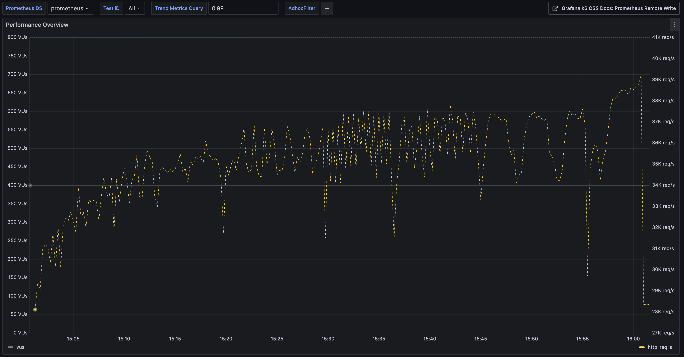
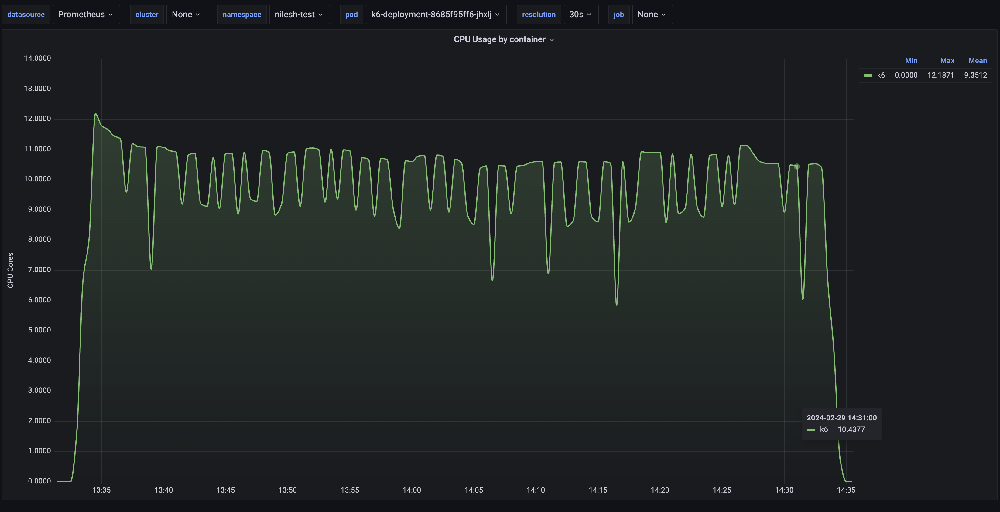
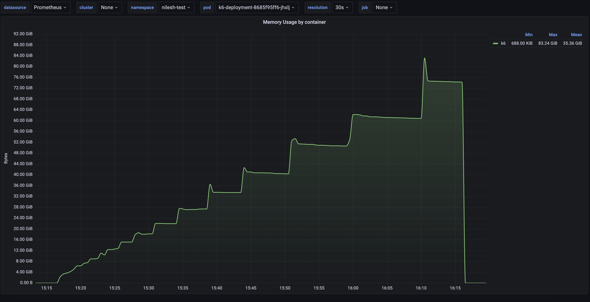
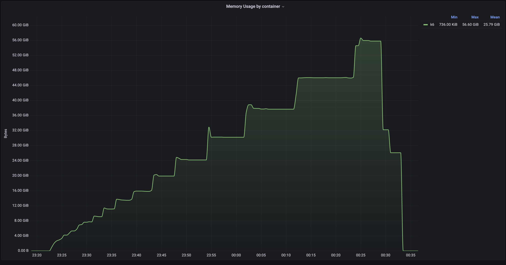

## K6 Prometheus Remote Write

Push K6 metrics to Prometheus via Remote Write Protocol

## Test SetUp

First Prometheus is configured in remote write mode as discussed [here](https://grafana.com/docs/grafana-cloud/monitor-infrastructure/kubernetes-monitoring/configuration/configure-infrastructure-manually/prometheus/remote-write-prometheus/), then using K6 remote write [option](https://k6.io/docs/results-output/real-time/prometheus-remote-write/) Native Histogram K6 metrics are sent to Prometheus Remote Write URL.

K6 tests run as,

```sh
K6_PROMETHEUS_RW_SERVER_URL=REMOTE_WRITE_URL \
K6_PROMETHEUS_RW_TREND_AS_NATIVE_HISTOGRAM=true \
k6 run -o experimental-prometheus-rw script.js
```


## Results

### Test with k6 script with single get api (script: scripts/httpbin_test_get.js)

| K6 setup, HTTPBIN setup                                                              | Test Scenario Stages| MAX TPS(req/s)       | MAX CPU Usage(cores)  | MAX Memory Usage      | 
|                    :-------:                                                         | :----------------:  |     :----:           |       :----:      |      :----:       |
| K6 CPU req 3 cores, httpbin CPU req 4 cores(2 repl)                                  | u:300, d: 60m       |       31K            | K6 = 6.752, httpbin_repl_1 = 2.94, httpbin_repl_2 = 2.7, Prometheus = 0.4(avg. 0.1)| K6 = 9923 Mi (Test Killed due to Node Memory got OOM(15Gi) at 33m), httpbin_repl_1 = 21 Mi, httpbin_repl_2 = 26 Mi, Prometheus = 830 Mi| 
| K6 CPU req 3 cores, httpbin CPU req 4 cores(2 repl)                                  | u:400, d: 60m       |       32K            | K6 = 7.1665, httpbin_repl_1 = 3.0209, httpbin_repl_2 = 3.0604, Prometheus = 0.234  | K6 = 10.37Gi (Test Killed due to Node Memory got OOM(15Gi) at 33m), httpbin_repl_1 = 18.23 Mi, httpbin_repl_2 = 23.4 Mi, Prometheus = 917.68 Mi|
| K6 CPU req 5 cores, limit 5.1 cores,httpbin CPU req 3 cores, limit 3.2 cores(2 repl) | u:400, d: 60m       | 39.2K (avg: 35.234K) | K6 = 5.1026, httpbin_repl_1 = 0.5153, httpbin_repl_2 = 3.1613, Prometheus = 0.081  | K6 = 25.24 Gi, httpbin_repl_1 = 12.47 Mi, httpbin_repl_2 = 49.91 Mi, Prometheus = 1007.83 Mi| 
| K6 CPU req 10 cores, httpbin CPU req 4 cores(2 repl)                                 | u:400, d: 60m       |     53.5K            | K6 = 8.0466, httpbin_repl_1 = 3.9087, httpbin_repl_2 = 3.9946, Prometheus = 0.0946 | K6 = 37.98 Gi, httpbin_repl_1 = 29.51 Mi, httpbin_repl_2 = 26.39 Mi, Prometheus = 886.18 Mi|
| K6 CPU req 10 cores, httpbin CPU req 4 cores(3 repl)                                 | u:400, d: 60m       |     74.6K            | K6 = 12.1871, httpbin_repl_1 = 3.72, httpbin_repl_2 = 4.1152, httpbin_repl_3 = 3.6722, Prometheus = 0.1619 | K6 = 55.73 Gi, httpbin_repl_1 = 26.5 Mi, httpbin_repl_2 = 23.38 Mi, httpbin_repl_3 = 26.14 Mi, Prometheus = 976.57 Mi|
| K6 CPU req 10 cores, httpbin CPU req 4 cores(4 repl)                                 | u:400, d: 60m       |     114K             | K6 = 18.9234, httpbin_repl_1 = 3.4808, httpbin_repl_2 = 7.5031, httpbin_repl_3 = 4.0696, httpbin_repl_4 = 3.8801, Prometheus = 0.1465 | K6 = 83.24 Gi, httpbin_repl_1 = 27.56 Mi, httpbin_repl_2 = 46.7 Mi, httpbin_repl_3 = 25.99 Mi, httpbin_repl_4 = 24.04 Mi, Prometheus = 987.05 Mi|

For max 39.2K TPS, here are important profiles, 

K6 CPU Profile,

       

K6 Memory Profile,


TPS Profile,



For max 53.5K TPS, here are important profiles, 

K6 CPU Profile,

       

K6 Memory Profile,


TPS Profile,


For max 74.6K TPS, here are important profiles, 

K6 CPU Profile,



K6 Memory Profile,


TPS Profile,


For max 114K TPS, here are important profiles, 

K6 CPU Profile,


K6 Memory Profile,



TPS Profile,


### Test with k6 script with single post api with random 11kb payload (script: scripts/httpbin_post_11kb.js)

| K6 setup, HTTPBIN setup                                                 | Test Scenario Stages   | MAX TPS(req/s)    | MAX CPU Usage(cores)  | MAX Memory Usage      | 
|                    :-------:                                            | :----------------:     |     :----:        |       :----:          |      :----:           |
| K6 CPU req 10 cores, httpbin CPU req 4 cores, CPU limit 5 cores(4 repl) | s: 5m:100, s: 30m:100  | 13K (avg 12.194K) | K6 = 5.7362, httpbin_repl_1 = 4.3516, httpbin_repl_2 = 4.1976, httpbin_repl_3 = 4.2937, httpbin_repl_4 = 4.9776, Prometheus = 0.1343 | K6 = 5.08 Gi, httpbin_repl_1 = 31.8 Mi, httpbin_repl_2 = 49.38 Mi, httpbin_repl_3 = 33.09 Mi, httpbin_repl_4 = 76.82 Mi, Prometheus = 953.19 Mi|

Here are important profiles,

K6 CPU Profile,


K6 Memory Profile,


TPS Profile,


### Test with k6 script with single post api with random 1kb payload (script: scripts/httpbin_post_1kb.js)


| K6 setup, HTTPBIN setup                                                 | Test Scenario Stages | MAX TPS(req/s)  | MAX CPU Usage(cores)  | MAX Memory Usage      | 
|                    :-------:                                            | :----------------:   |     :----:      |       :----:          |      :----:           |
| K6 CPU req 10 cores, httpbin CPU req 4 cores, CPU limit 5 cores(4 repl) | s: 5m:5, s: 30m:5    | 14.1K (avg 13K) | K6 = 2.6352, httpbin_repl_1 = 0.0001, httpbin_repl_2 = 0.6193, httpbin_repl_3 = 0.4962, httpbin_repl_4 = 2.118, Prometheus = 0.1598 | K6 = 5.97 Gi, httpbin_repl_1 = 21.11 Mi, httpbin_repl_2 = 33.3 Mi, httpbin_repl_3 = 36.41 Mi, httpbin_repl_4 = 52.69 Mi, Prometheus = 992.87 Mi|

Here are important profiles,

K6 CPU Profile,


K6 Memory Profile,


TPS Profile,


### Test with k6 script with 3 Get apis (script: scripts/httpbin_multiapi_1.js)

| K6 setup, HTTPBIN setup                                                 | Test Scenario Stages | MAX TPS(req/s)  | MAX CPU Usage(cores)  | MAX Memory Usage      | 
|                    :-------:                                            | :----------------:   |     :----:      |       :----:          |      :----:           |
| K6 CPU req 10 cores, httpbin CPU req 4 cores, CPU limit 5 cores(4 repl) | s: 5m:300, s: 60m:300 (Avg Iter: 25.178K)   | 81.7K (avg 75.534K) | K6 = 11.935, httpbin_repl_1 = 3.3117, httpbin_repl_2 = 3.0646, httpbin_repl_3 = 3.5636, httpbin_repl_4 = 2.6193, Prometheus = 0.1301 | K6 = 56.6 Gi, httpbin_repl_1 = 25.18 Mi, httpbin_repl_2 = 32.28 Mi, httpbin_repl_3 = 38.81 Mi, httpbin_repl_4 = 51.64 Mi, Prometheus = 1.01 Gi|

K6 CPU Profile,


K6 Memory Profile,



TPS Profile,


### Test with k6 script with 2 Get apis and one post api with 11kb payload (script: scripts/httpbin_multiapi_2.js)

| K6 setup, HTTPBIN setup                                                 | Test Scenario Stages | MAX TPS(req/s)  | MAX CPU Usage(cores)  | MAX Memory Usage      | 
|                    :-------:                                            | :----------------:   |     :----:      |       :----:          |      :----:           |
| K6 CPU req 10 cores, httpbin CPU req 4 cores, CPU limit 5 cores(4 repl) | s: 5m:300, s: 30m:300 (Avg Iter: 10.563K)   | 33.2K (avg 31.69K) | K6 = 8.6556, httpbin_repl_1 = 4.5924, httpbin_repl_2 = 4.6148, httpbin_repl_3 = 4.5020, httpbin_repl_4 = 4.6566, Prometheus = 0.1469 | K6 = 11.74 Gi, httpbin_repl_1 = 25.68 Mi, httpbin_repl_2 = 32.63 Mi, httpbin_repl_3 = 24.7 Mi, httpbin_repl_4 = 48.24 Mi, Prometheus = 1.02 Gi|

K6 CPU Profile,


K6 Memory Profile,


TPS Profile,


### Test with k6 script with 1 Get apis and two post apis with 1kb and 11kb payload (script: scripts/httpbin_multiapi_3.js)

| K6 setup, HTTPBIN setup                                                 | Test Scenario Stages | MAX TPS(req/s)  | MAX CPU Usage(cores)  | MAX Memory Usage      | 
|                    :-------:                                            | :----------------:   |     :----:      |       :----:          |      :----:           |
| K6 CPU req 10 cores, httpbin CPU req 4 cores, CPU limit 5 cores(4 repl) | s: 5m:300, s: 30m:300 (Avg Iter: 9.902K)   | 31K (avg 29.708K) | K6 = 8.5111, httpbin_repl_1 = 4.4495, httpbin_repl_2 = 4.7227, httpbin_repl_3 = 4.5696, httpbin_repl_4 = 4.798, Prometheus = 0.1481 | K6 = 11.69 Gi, httpbin_repl_1 = 25.91 Mi, httpbin_repl_2 = 29.63 Mi, httpbin_repl_3 = 25.48 Mi, httpbin_repl_4 = 57.61 Mi, Prometheus = 1.03 Gi|

K6 CPU Profile,


K6 Memory Profile,


TPS Profile,


### Test with k6 script with 2 post apis with 1kb payload and one post api with 11kb payload (script: scripts/httpbin_multiapi_4.js)

| K6 setup, HTTPBIN setup                                                 | Test Scenario Stages | MAX TPS(req/s)  | MAX CPU Usage(cores)  | MAX Memory Usage      | 
|                    :-------:                                            | :----------------:   |     :----:      |       :----:          |      :----:           |
| K6 CPU req 10 cores, httpbin CPU req 4 cores, CPU limit 5 cores(4 repl) | s: 5m:400, s: 30m:400 | 31K (avg 29.436K) | K6 = 8.7551, httpbin_repl_1 = 4.7337, httpbin_repl_2 = 4.8277, httpbin_repl_3 = 4.791, httpbin_repl_4 = 4.7447, Prometheus = 0.2094 | K6 = 12.23 Gi, httpbin_repl_1 = 35.46 Mi, httpbin_repl_2 = 40.79 Mi, httpbin_repl_3 = 38.99 Mi, httpbin_repl_4 = 61.94 Mi, Prometheus = 1.02 Gi|

K6 CPU Profile,


K6 Memory Profile,


TPS Profile,


## Inferences

* High TPS is achievable using Prometheus native histogram metrics, here we have achieved upto 110K http requests per second via horizontal and vertical scaling of resources, no metrics is lost which was of great concern with K6 Influxdb client at High TPS.
* Observed Prometheus CPU reaches upto 200m and memory remains under 1 Gi. Consistent results for multiapi tests also.

* Note -> We have not tested K6 promtheus trend stats metrics [counter and gauge](https://k6.io/docs/results-output/real-time/prometheus-remote-write/#counter-and-gauges) for high tps here, later we tested this to see the resource comparision with respect to native histograms and observed metric flush time increases after tps reaches 25K, the reason behind this behaviour is beautifully explained [here](https://github.com/grafana/k6/issues/3498)

